# Level 2 基本篇

## 2.1 所属方

## 2.1.1 所属方概念
* 所属方类型
* 所属方实例

## 2.1.2 更改对象所属
* 通过树形列表  
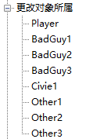
* 通过物体属性选项  
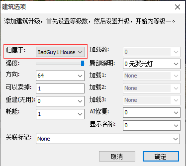
* 物体的所属方信息会显示在左下角  
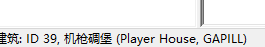
* 通过触发事件 - 更改单个物体的所属方  
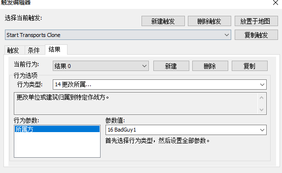
* 通过触发事件 - 更改特定所属方全部物体到目标所属方  
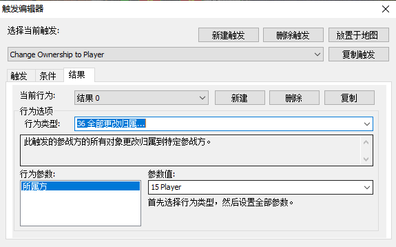  
注意该触发的来源所属方绑定的是触发事件设置里的所属方  
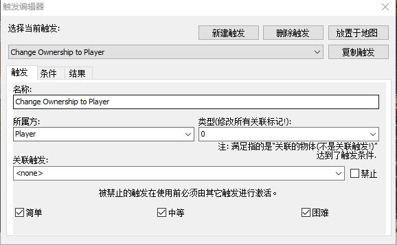  
* 将触发事件关联到物体  
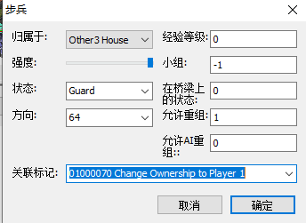  

## 2.1.3 所属方参数面板
* IQ

* 地图边界  
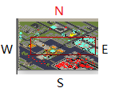  
* 科技等级
科技等级会影响到AI触发对科技等级的判断，也会影响到AI生产单位对单位类型的判断
* 游戏者控制

* 盟友关系  
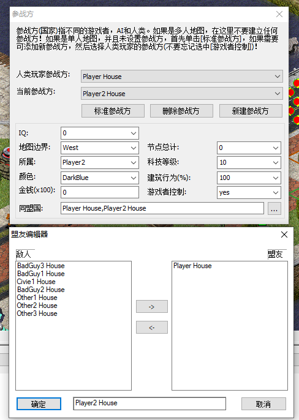  
注意这里的结盟是单向的，可以类比理解多人游戏中的单方结盟方式

* 新建所属方  
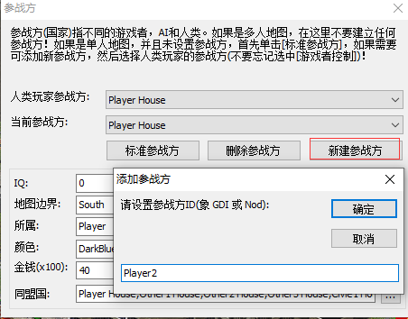

## 2.1.4 结盟与宣战
* 结盟触发  
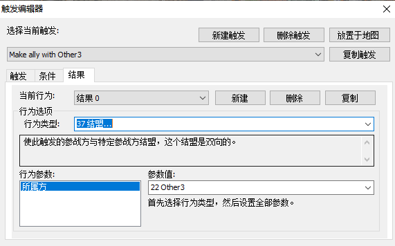  
注意这个结盟是双向的

* 宣战，并激活仇恨  
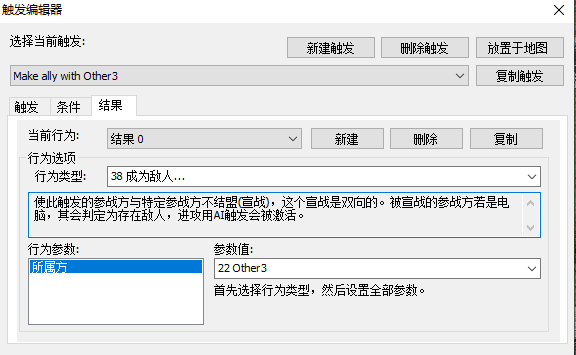  
建议总是在适当的时机调用该触发让AI敌对方能正确刷新对玩家的仇恨