# Level 2 基本篇

## 2.1 所属方

## 2.1.1 所属方概念

> 这里纯纯是我的个人理解了。还请对游戏所属有深刻见地的佬多多批评斧正。

我们不妨从联机的视角来理解「所属」这个东西。  
好比一个房间里有四法四伊，那“法伊”就是**国家**，那些玩家就叫具体的**所属**。每一个玩Fa国的玩家他们都拥有Fa国才能造的巨炮，但每个玩Fa国的肯定颜色都不一样，对吧。

~~用面向对象来理解就是很明显的类和实例的关系了。当然这么描述并不准确。~~

## 2.1.2 更改对象所属
* 通过树形列表  
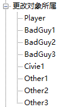
* 通过物体属性选项  
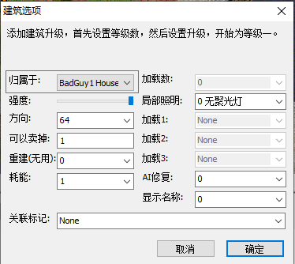
* 物体的所属方信息会显示在左下角  
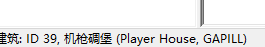
* 通过触发事件 - 更改单个物体的所属方  
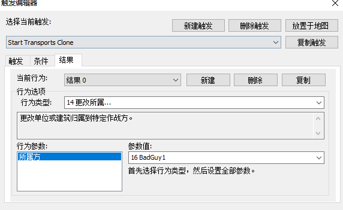
* 通过触发事件 - 更改特定所属方全部物体到目标所属方  
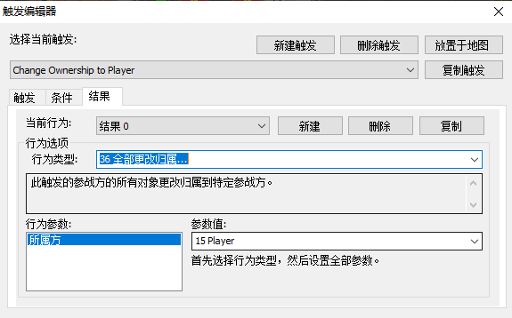  
注意该触发的来源所属方绑定的是触发事件设置里的所属方  
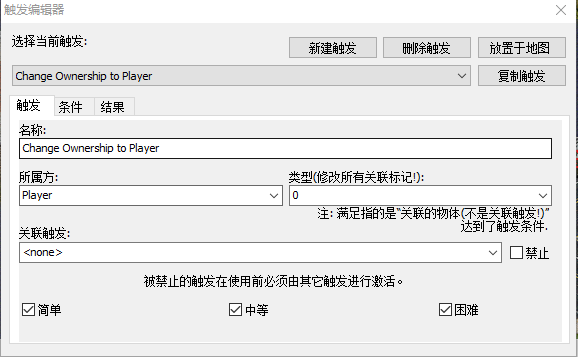  
* 将触发事件关联到物体  
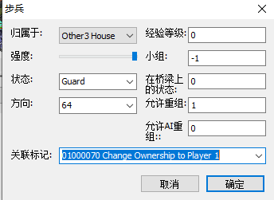  

## 2.1.3 所属方参数面板
* IQ
不同 mod 对 IQ 的设定有所不同。一般只讨论 0 和最大值两种情形。
* 地图边界  
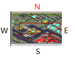  
* 科技等级
科技等级会影响到AI触发对科技等级的判断，也会影响到AI生产单位对单位类型的判断
* 游戏者控制

* 盟友关系  
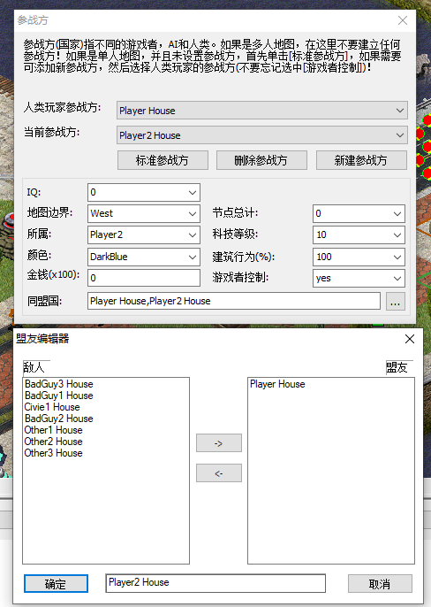  
注意这里的结盟是单向的，可以类比理解多人游戏中的单方结盟方式

* 新建所属方  
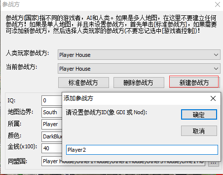

## 2.1.4 结盟与宣战
* 结盟触发  
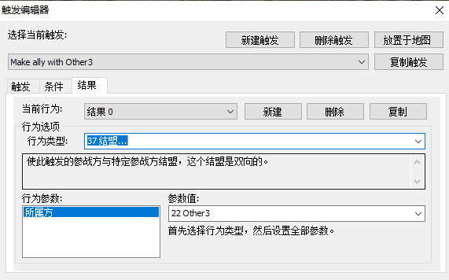  
注意这个结盟是双向的

* 宣战，并激活仇恨  
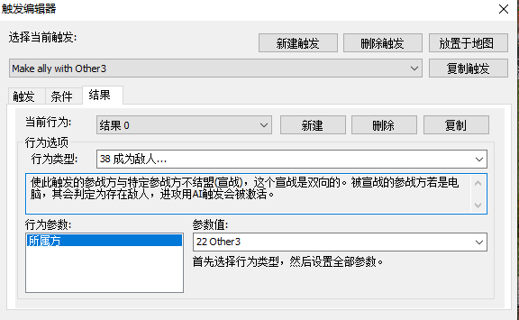  
建议总是在适当的时机调用该触发让AI敌对方能正确刷新对玩家的仇恨