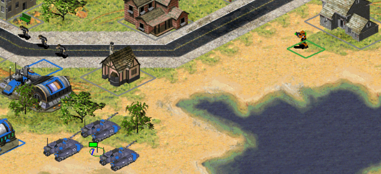
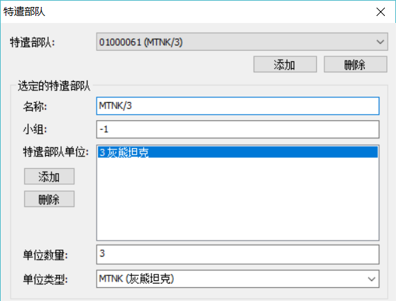
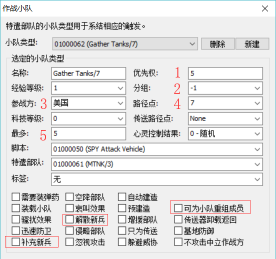
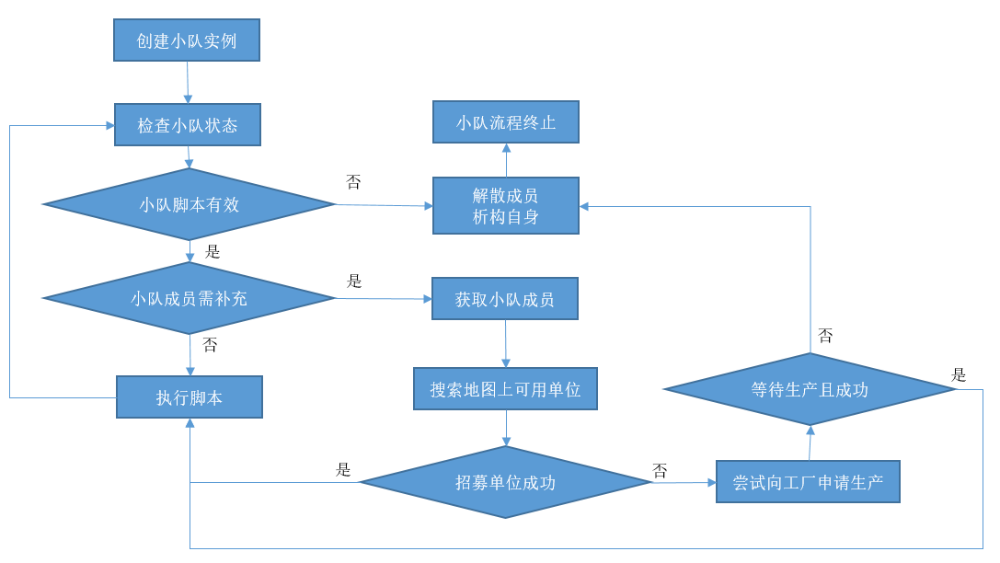

## 概述
4建立小队这个触发行为在地图中是很常用的，尤其是用来控制已经存在于地图上的单位执行一定的脚本。实际上这个触发仅仅是调用了小队本身的一个特性，这个特性称作小队的招募与重组，下面将先介绍用法，再介绍原理。

## 用法
* 最直观常用的用法，就是直接招募指定路径点处的单位直接进指定小队，然后执行脚本。

图1

* 如图1所示，如果我想招募路径点7处的3个灰熊坦克，那么我就应该这样写小队：

图2

图3

1. 优先级决定了你重组小队时的优先等级，优先级越大意味着等级越高。在其他设置都相同的情况下，优先级高的可以强制将低优先级的小队成员纳入自己的小队里，例如优先级为5的小队可以将正在执行任务的优先级为4的小队成员抽调过来。当然抽调的检查实际上远非这么简单，这里仅仅举了个理想化的例子，后文会详细介绍抽调的具体判定规则。
2. 分组决定了小队的组别ID，默认值-1为无组别，可设置的值跨越所有可用的整数范围，正负都可以。一般不建议设置成其它值，如果为非负整数，例如0\~9，将被赋予1\~10的小队编号。需要注意的是，除了-1，还有两个保留值有特殊含义，分别是-2和-40094，使用时尽量避免，除非你确实需要这几个值的特殊效果，后文将介绍它们的用途。
3. 这里填写小队的所属，跨所属方组队是不可能的，所以你这里选美国就只能吸纳美国所属方的小队，如果你写了其它所属方，是没法招募美国所属的小队的。实际应用中可能会需要将一个玩家单位调离地图，而又不想让玩家控制，这将可以在脚本中实现，介绍脚本时单独再提。
4. 路径点，即你想招募的小队所在的路径点，可以不填写，则会跨越整个地图来寻找所属方的小队，如果小队不存在，则可能考虑使用工厂来生产这个小队成员（部分或者全部，玩家的单位不会强制申请从工厂生产）。路径点附近的招募范围是由全局变量控制的，位于[General]下的Stray。超出范围将会招募不到
5. 这里限制了小队最多允许创建多少个实例，如果地图上已经有这么多个实例存在了，那么再次用触发创建的时候会被忽略。

* 红框选中的格子是小队的特性，将在后面讲解用途。

## 小队运作原理

## 小队重组/强制招募
* 试想一下这种情况:一个正在巡逻的小队，因为某种突发情况需要被招募到前线，那么此时就需要征用已存在的小队成员去执行任务。
* 或者参考原版中一个经典的例子，RA2苏2维拉迪摩指挥艇轰击完海岸线之后向敌军舰队冲锋，最终又落荒而逃。

## 无条件招募/有条件招募
* 招募的基本原则: 小队分组为-1的可被任意-1分组的小队招募，而分组为-2的可被任意分组的小队招募。带有非负数分组的小队不可被招募。
* 无条件招募: 在以往的地图编辑器中往往被翻译为“可被重组”，根据实测和modenc的解释，无条件招募开启时，小队成员可被任意其他小队的招募选中，但前提是遵循招募的基本原则;
* 有条件招募: 以往被翻译为“可被AI重组”，实际上它表示一种特定条件下的允许被招募，与是否为AI所控制无关。有条件招募开启时，带有“考虑使用工厂”选项的小队招募时会被该小队选中，仍然遵循招募的基本原则;
* 考虑使用工厂: 以往被翻译为“自动创建”，但它事实上表示一种更广范围的招募，并且特定条件下招募不成功将通过工厂进行生产。
