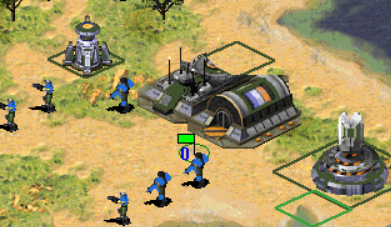
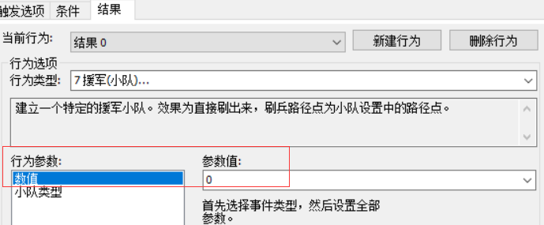
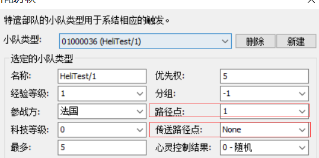

## 概述
触发行为的“7-援军小队”与“80-援军小队”的80%功能是重叠的，在大部分时候，你需要在地图上刷出小队时，任选其一即可。下面讲解的主要是他们的特殊之处和不同点。

## 特殊之处
* 如果你有幸尝试过在建筑附近刷出小队（如图1），你会惊奇的发现小队是从建筑里“走出来”的。

图1

* 但是有的时候，实际上你并不希望小队是从建筑里“走出来的”，因为可能会破坏初始的队形，**Hares联合RN版的地图编辑器**（图2）提供了这么一个参数来控制这个行为。

图2

* 这个参数值默认是0，兼容不支持这个功能的地图，因为这个数值本来就是0。为1的时候，表示“禁止单位从附近的建筑里走出来”，而是直接原地刷出。

## 不同点
* 首先最直观的不同点就是两个触发的参数个数是有差异的，80援军小队比7援军小队多了1个路径点的参数。
* 同时你观察到小队类型的设置里（图3），也有两个路径点的设置。

图3

* 如图3所示，通常情况下传送路径点都是不填的，而这时候在使用行为80的时候，小队里的路径点可以写0或者不写，完全由行为80指定的路径点来控制。由此可以实现一个小队成员、脚本完全相同的小队类型，由触发行为80刷在几个不同的路径点上。（例如在路径点1~5刷5个基洛夫小队攻击敌军建筑）。
* 行为7则严格遵循你在小队类型里设置的路径点（因为触发行为不提供额外的小队路径点设置），如果你填了0，小队就会刷在路径点0，填了10就会刷在路径点10处。
* 那么小队类型里的传送路径点又是干什么用的呢？目前我仅了解到可以用作空降部队的飞机出生点。例如小队设置中传送路径点填15，路径点填16，同时勾选小队的“空降部队”，那么小队生成时，会在路径点15产生一个空降飞机，然后到路径点16将你的小队投放出来。此时推荐使用触发行为7来生成小队，或者触发行为80的时候，小队类型里的路径点要保持和小队设置里的路径点相同，由于容易搞混而得不到想要的效果，仍然推荐使用触发行为7来刷这种小队。